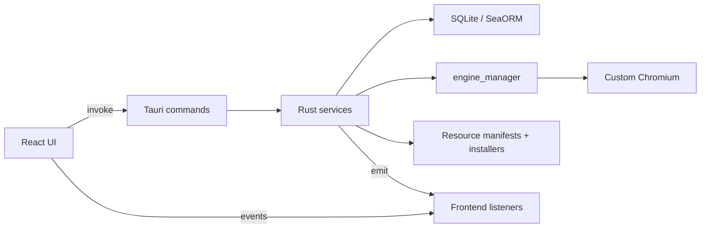

# Architecture

## Runtime Shape

Multi-Flow is a local-first Tauri v2 desktop app. The React UI owns interaction and view state. Rust owns desktop capabilities, SQLite persistence, browser process management, local API serving, resource installation, and sidecar coordination.

## Frontend

- `src/app`: router, shell, navigation, global listeners.
- `src/pages`: route-level composition.
- `src/widgets`: page shells and larger composition blocks.
- `src/features`: business actions, forms, mutations, and workflow UI.
- `src/entities`: domain display models, query hooks, and read models.
- `src/shared`: shared API clients, i18n, utilities, and low-level helpers.
- `src/components`: reusable UI primitives.

Forms that submit user input use `react-hook-form` with `zodResolver`.

## Backend

- `src-tauri/src/commands`: Tauri command boundary and input mapping.
- `src-tauri/src/services`: application services and persistence orchestration.
- `src-tauri/src/db`: SeaORM entities, migrations, and database setup.
- `src-tauri/src/engine_manager`: Chromium process/session lifecycle and launch arguments.
- `src-tauri/src/runtime_guard.rs`: runtime reconciliation and process recovery.

Commands that do file I/O, database re-query, process work, downloads, or loops must be `async` and offload blocking work with `tauri::async_runtime::spawn_blocking` or an equivalent async boundary.

## Data Flow

1. UI calls a typed API wrapper around Tauri `invoke`.
2. Command validates input and calls a service.
3. Service reads or writes SQLite through SeaORM, or delegates to engine/resource managers.
4. Long-running work reports progress with events instead of blocking the invoke call.
5. UI listeners update query cache, Zustand UI state, or show user feedback.

## Observability

- Rust panic hook logs panic message and backtrace.
- Backend logs are written under the Tauri application support log directory.
- Frontend error boundaries dispatch `multi-flow:frontend-error` events instead of writing to `console`.
- Any telemetry must be opt-in and must not report paths, usernames, tokens, file content, or profile data by default.

## Release Boundary

See [docs/release.md](docs/release.md). Release CI builds macOS arm64/x64, Windows x64, and Linux x64. Signing and notarization require CI secrets; local unsigned builds are only for verification.
