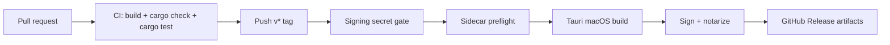

# Release Guide

This project currently ships signed macOS DMG builds only. Windows and Linux CI
coverage validates source compatibility, but installer publishing is blocked
until sidecar binaries exist for those targets.

## Version Source

Keep these three files on the same version:

- `package.json`
- `src-tauri/Cargo.toml`
- `src-tauri/tauri.conf.json`

Run:

```bash
pnpm -s release:check
```

CI fails when the versions or pinned package manager drift.

## Required Toolchains

- Node.js: `.nvmrc`
- pnpm: `package.json#packageManager`
- Rust: `rust-toolchain.toml`

CI uses the same pinned versions for pull requests and release builds.

## macOS Release

Tag pushes matching `v*` trigger `.github/workflows/release.yml`.

Required GitHub secrets:

- `APPLE_CERTIFICATE`: base64 `.p12` Developer ID Application certificate
- `APPLE_CERTIFICATE_PASSWORD`: `.p12` export password
- `APPLE_SIGNING_IDENTITY`: `Developer ID Application: ...`
- `APPLE_ID`: Apple ID used for notarization
- `APPLE_PASSWORD`: app-specific password
- `APPLE_TEAM_ID`: 10-character Apple Team ID

Unsigned releases are blocked. If any required secret is missing, the release
workflow exits before building artifacts.

Current macOS targets:

| Target | Runner | Artifact |
|---|---|---|
| `aarch64-apple-darwin` | `macos-latest` | `.app`, `.dmg` |
| `x86_64-apple-darwin` | `macos-13` | `.app`, `.dmg` |

## Windows And Linux

| Platform | Status | Blocker |
|---|---|---|
| Windows 10/11 x64 | CI source check only | Missing `multi-flow-sync-manager-x86_64-pc-windows-msvc.exe` |
| Ubuntu/Fedora x64 | CI source check only | Missing `multi-flow-sync-manager-x86_64-unknown-linux-gnu` |

Do not enable Windows or Linux installer publishing until the sync sidecar is
built, signed where applicable, and covered by smoke tests.

## Updater

The in-app updater is not enabled yet.

Before enabling it:

1. Add `tauri-plugin-updater` to Rust and frontend dependencies.
2. Generate updater signing keys with the Tauri CLI.
3. Store the private key only in offline secret storage or CI secrets.
4. Commit only the public key and HTTPS endpoints.
5. Enable updater artifact generation in `tauri.conf.json`.
6. Test install, update, downgrade rejection, and rollback on each published target.

## Rollback

1. Keep the previous GitHub Release available.
2. If a release is bad, mark it as pre-release or remove it from the download page.
3. Publish a new patch tag from the previous known-good commit.
4. If the updater is later enabled, update `latest.json` to point to the rollback patch.

## Flow


