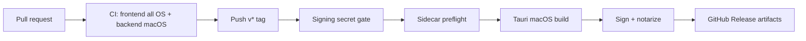

# Release Guide

This project currently ships signed macOS DMG builds only. Windows and Linux CI
coverage validates frontend compatibility, but backend checks and installer
publishing are blocked until sidecar binaries exist for those targets.

## Version Source

Keep these three files on the same version:

- `package.json`
- `src-tauri/Cargo.toml`
- `src-tauri/tauri.conf.json`

Run:

```bash
pnpm -s release:check
```

CI fails when the versions or pinned package manager drift.

## Required Toolchains

- Node.js: `.nvmrc`
- pnpm: `package.json#packageManager`
- Rust: `rust-toolchain.toml`

CI uses the same pinned versions for pull requests and release builds.

## macOS Release

Tag pushes matching `v*` trigger `.github/workflows/release.yml`.

Required GitHub secrets:

- `TAURI_SIGNING_PRIVATE_KEY`: Tauri updater private key
- `TAURI_SIGNING_PRIVATE_KEY_PASSWORD`: updater key password, if the key uses one

Optional macOS signing/notarization secrets:

- `APPLE_CERTIFICATE`: base64 `.p12` Developer ID Application certificate
- `APPLE_CERTIFICATE_PASSWORD`: `.p12` export password
- `APPLE_SIGNING_IDENTITY`: `Developer ID Application: ...`
- `APPLE_ID`: Apple ID used for notarization
- `APPLE_PASSWORD`: app-specific password
- `APPLE_TEAM_ID`: 10-character Apple Team ID

If the updater signing key is missing, the release workflow exits before
building artifacts. If Apple signing/notarization secrets are missing, the
workflow still builds unsigned/not-notarized macOS artifacts.

Current macOS targets:

| Target | Runner | Artifact |
|---|---|---|
| `aarch64-apple-darwin` | `macos-latest` | `.app`, `.dmg` |
| `x86_64-apple-darwin` | `macos-13` | `.app`, `.dmg` |

## Windows And Linux

| Platform | Status | Blocker |
|---|---|---|
| Windows 10/11 x64 | Frontend CI only | Missing `multi-flow-sync-manager-x86_64-pc-windows-msvc.exe` |
| Ubuntu/Fedora x64 | Frontend CI only | Missing `multi-flow-sync-manager-x86_64-unknown-linux-gnu` |

Do not enable Windows or Linux installer publishing until the sync sidecar is
built, signed where applicable, and covered by smoke tests.

## Updater

The in-app updater is enabled for macOS releases. It reads:

```text
https://github.com/jt302/multi-flow/releases/latest/download/latest.json
```

Generate the updater key locally and keep the private key out of git:

```bash
pnpm tauri signer generate --ci -w ~/.tauri/multi-flow.key
```

Commit only the public key in `src-tauri/tauri.conf.json`. Add the private key
contents to GitHub secret `TAURI_SIGNING_PRIVATE_KEY`; set
`TAURI_SIGNING_PRIVATE_KEY_PASSWORD` only when the key is password protected.

Release verification:

1. Confirm the release assets include `.app.tar.gz`, `.app.tar.gz.sig`, `.dmg`,
   and `latest.json`.
2. Open the `latest.json` URL above and verify the version, notes, URLs, and
   signatures point to the current release.
3. Install the previous release, trigger update check, approve install, and
   confirm the app restarts into the new version.
4. With running environments or automation tasks, confirm update install is
   blocked with a clear message.

If the private key is lost, existing installs cannot trust future updater
artifacts signed by a new key.

## Rollback

1. Keep the previous GitHub Release available.
2. If a release is bad, mark it as pre-release or remove it from the download page.
3. Publish a new patch tag from the previous known-good commit.
4. Publish a signed rollback patch so `latest.json` points to the fixed version.

## Flow


